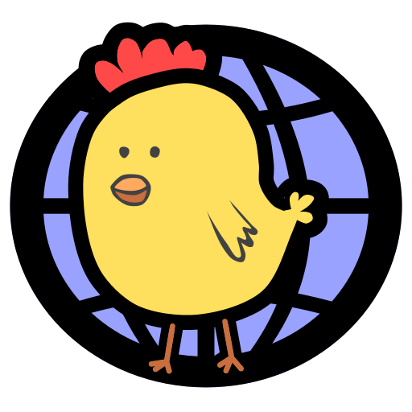

# Chickensoft Website

[](https://app.netlify.com/sites/chickensoft/deploys)

The official [Chickensoft Website](https://chickensoft.games).

---

<p align="center">

</p>

This is a Next.js application generated with
[Create Fumadocs](https://github.com/fuma-nama/fumadocs).

Run development server:

```bash
npm run dev
```

Open <http://localhost:3000> with your browser to see the result.

## Contributing

If you're adding more than just documentation, it would help to be familiar with Next.js and Fumadocs:

- [Next.js Documentation](https://nextjs.org/docs) - learn about Next.js
  features and API.
- [Learn Next.js](https://nextjs.org/learn) - an interactive Next.js tutorial.
- [Fumadocs](https://fumadocs.vercel.app) - learn about Fumadocs
