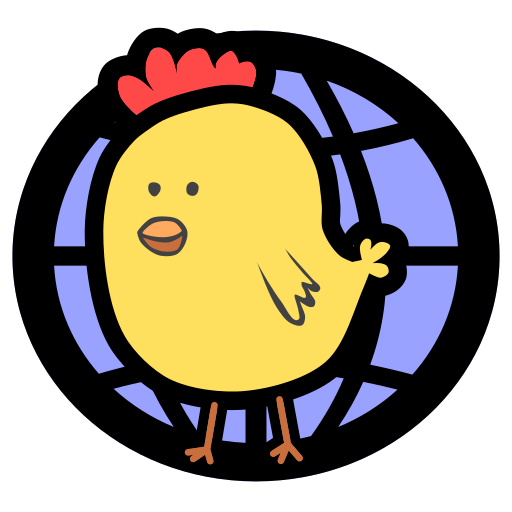

# Chickensoft Site

[![Chickensoft Badge][chickensoft-badge]][chickensoft-website] [![Discord][discord-badge]][discord] [![Read the docs]][read-the-docs-badge]

The official [Chickensoft Website][chickensoft-website]. Built using [Docusaurus 2](https://docusaurus.io/), a modern static website generator.

---

<p align="center">

</p>

## ⚙️ Installation

```sh
npm install
```

## 🧑‍💻 Local Development

```sh
npm run start
```

This command starts a local development server and opens up a browser window. Most changes are reflected live without having to restart the server.

## 📦 Build

```sh
npm run build
```

This command generates static content into the `build` directory and can be served using any static contents hosting service.

## ☁️ Deployment

Deployment occurs every day and whenever the main branch is updated. 🪄

<!-- Links -->

<!-- Header -->

[chickensoft-badge]: https://chickensoft.games/images/chickensoft/chickensoft_badge.svg
[read-the-docs-badge]: https://chickensoft.games/img/badges/read_the_docs_badge.svg
[chickensoft-website]: https://chickensoft.games
[discord]: https://discord.gg/gSjaPgMmYW
[discord-badge]: https://img.shields.io/badge/Chickensoft%20Discord-%237289DA.svg?style=flat&logo=discord&logoColor=white
