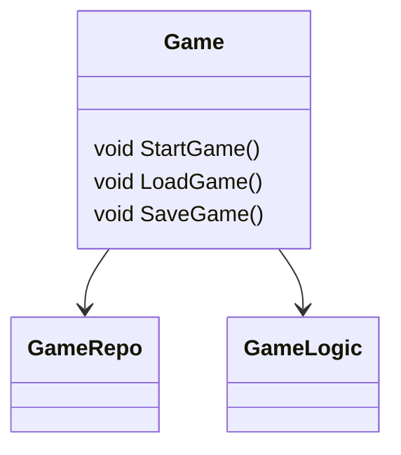

As a developer, I've worked for many different forms of industries, from fin-tech, to e-commerce, human resources, and even agri-tech. They all had their own style of doing things, some being very organized, while others lacked any form of documentation. Let's face it, documentation is hard, but it doesn't have to be difficult.

{/* truncate */}

One of the things I always look for when being first introduced to a project is some form of relationship diagram. I want to have a big picture of how everything is interconnected. I don't find myself being comfortable with making changes unless I know exactly how this will affect the whole system.

I'd use tools in JetBrains to generate dependency diagrams, and I'd try looking for solutions online, but it would always end up being too complicated, or not exactly giving me the results that I want.

While working on my project (Utopia ~ still under development), I use a lot of Chickensoft packages, and I was always fascinated with how the LogicBlocks package generated its own diagrams to show how the state machine functioned. It made me think, how come this sort of thing doesn't exist for the project itself? The whole Godot hierarchy could be represented by a `.puml` diagram, and I wouldn't have to keep running through different scene files trying to remind myself how I set things up again.

That's when the idea of UMLGenerator came! I quickly came to the Chickensoft community, asking around if my this has ever been done before? Was there any reasons not to? Was there was any interest in a project like this? Sure enough, it looked like this was a good idea and off I went researching on how to accomplish this!

First of all, If I was going to visualize a hierarchy, we needed to know what children a scene had, and the best way to accomplish this was to check to check the `.tscn` files. Luckily there was already a project: [godot-tscn-parser](https://github.com/MihaMarkic/godot-tscn-parser)

With that out of the way, all that was left was to understand how source generators work. I hadn't built a source generator before, but I sort of had an idea.. Let me start by breaking down the entire process.

1. We first need a way to pull all the data. We essentially need all the C# and .tscn files which are core to our game project. The way I accomplished this is by having the user define all the `.tscn` files we want parsed as an AdditionalFile in the `.csproj` files. The `.cs` files are then imported by ensuring that the SyntaxTree file path contains the project directory.
- I did consider also having all the `.tscn` files in the project directory be imported, but then I ran into some parsing problems with some godot addons, so ultimately I decided against it
2. Afterwards we link everything together as parent child relationships. `.cs` files with the \[ClassDiagram] attribute are used as the root of the hierarchy. `.tscn` files which have a root `.cs` script are paired together. Then everything is given a assigned a relationship based on the hierarchy of the `.tscn` or the properties that the `.cs` file has.
3. Once everything is linked together it's just a matter of recursively going down the hierarchy and returning the diagram output string of each child and concatenating everything together.

Example:
Given the following project hierarchy


GameRepo and GameLogic would be linked as children to the Game class.
Then we would call the method to generate the diagram for the Game class, which would then call the respective methods to generate a diagram for the GameRepo and GameLogic classes.

GameRepo and GameLogic would return their respective diagrams, be concatenated with each other, and then be nested under the diagram for the Game class.

```PlantUML
package Game-Scene [[../../TestCases/BaseProject_Rider/Game.tscn]] {

class Game {

[[../../Game/Game.cs ScriptFile]]

--

[[../../Game/Game.cs:22 GameLogic]] - [[../../TestCases/BaseProject_Rider/Logic/GameLogic.cs Script]]

[[../../Game/Game.cs:21 GameRepo]] - [[../../TestCases/BaseProject_Rider/Domain/GameRepo.cs Script]]

}

class GameRepo {

[[../../TestCases/BaseProject_Rider/Domain/GameRepo.cs ScriptFile]]

}

class GameLogic {

[[../../TestCases/BaseProject_Rider/Logic/GameLogic.cs ScriptFile]]

}

Game::GameRepo --> GameRepo

Game::GameLogic --> GameLogic

}
```

As your project grows, so does your diagram. What starts off as a basic visualization becomes a full-blown map of your application, one that evolves with every new class, every scene change, every feature.

We’ve added logic to simplify output by avoiding rendering child nodes unless they also have children, keeping things clean and readable. But the point is: **you no longer have to memorize your codebase’s architecture.** It’s right there, clickable and up-to-date.

UMLGenerator is still in active development, and there’s plenty more I want to add like:
- Find UseTransient/UseSingleton/UseScoped to draw relationships
- Look for lists of components and draw one to many relationships
- Create Godot plugin for non-C# projects

But even in its current form, it’s already made my life easier — and if you’re working on a Godot + C# project, I think it could do the same for you.

👉 Check it out here: [github.com/chickensoft-games/UMLGenerator](https://github.com/chickensoft-games/UMLGenerator)

If you’ve got ideas, feedback, or want to contribute, don’t hesitate to jump in!