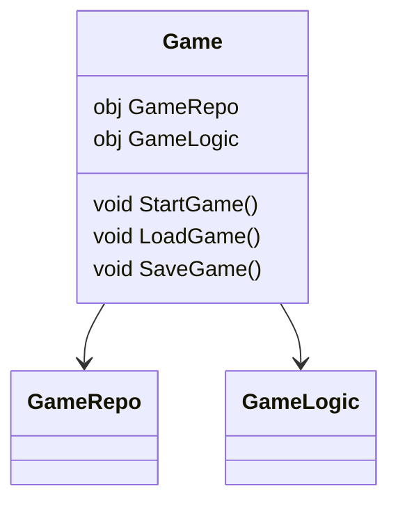

As a developer, I've worked in many different industries spanning fin-tech, e-commerce, human resources, and even agri-tech. They all had their own style of doing things. Some were very organized, while others lacked any form of documentation. Let's face it: documentation is hard, _but it doesn't have to be difficult_.

{/* truncate */}

I always look for some form of relationship diagram when I'm first introduced to a project. Ideally, I want to see picture of how everything is connected. I don't feel comfortable making changes unless I know exactly how they will affect the whole system.

I have tried using tools in JetBrains to generate dependency diagrams or look for online diagram generator tools, but it would always end up being too complicated or not clear enough.

<FancyImage src={"/blogs/visualizing-complexity/rider_diagram.png"} alt="Example of Jetbrains Rider Type Dependency Diagram" />

While working on my own game project (_Utopia_ ~ still under development), I have been using a lot of Chickensoft packages. I was always fascinated with how the [LogicBlocks](/docs/logic-blocks) package generates its own diagrams to show how the state machine functioned. It made me think "how come this sort of thing doesn't exist for the project itself? The whole Godot hierarchy could be represented by a `.puml` diagram, and I wouldn't have to keep running through different scene files trying to remind myself how I set things up."

That's how the idea for UMLGenerator came to me! I asked the Chickensoft community if anyone had done this before or if there there were any reasons not to. I wanted to know if there was any interest in an architecture diagram generator. Sure enough, folks showed interest and I went researching on how to accomplish it!

First of all, If I was going to visualize a hierarchy, I needed to know what children a scene had. The best way to accomplish this was to check to parse the `.tscn` files. Luckily there was already a project to parse Godot scene files: [godot-tscn-parser](https://github.com/MihaMarkic/godot-tscn-parser).

With that out of the way, I simply needed to understand how source generators worked. I hadn't built a source generator before, but I had a vague idea. Let me explain.

1. I first needed a way to read all the data. I essentially need all the C# and .tscn files which are core to a game project. I accomplished this by having the user define all the `.tscn` files we want parsed as an `AdditionalFile` in the `.csproj` file. The `.cs` files are then imported by ensuring that the `SyntaxTree` file path contains the project directory.
<Callout type="info">
    I did consider importing the `.tscn` files in the project directory, but I ran into some parsing problems with godot addons and ultimately decided against it.
</Callout>
2. Afterwards I link everything together via parent-child relationships. The `.cs` files with \[ClassDiagram] attributes are used as the root of the hierarchies. Each `.tscn` file which has a root `.cs` script are paired together. Then, everything is given an assigned relationship based on the hierarchy of the scene file or the properties in its script file (if it has one).
3. Once everything is linked together, it's just a matter of recursively going down the hierarchy and returning the diagram output string of each child and concatenating everything together.

For example:


`GameRepo` and `GameLogic` would be linked as children to the `Game` class.
The generator would then call the method to generate the diagram for the `Game` class, which in turn calls the respective methods to generate a diagram for the `GameRepo` and `GameLogic` classes.

`GameRepo` and `GameLogic` would return their respective diagrams, be concatenated with each other, and then be nested under the diagram for the `Game` class.

<details>
<summary><code>Game.g.puml</code> Example</summary>
```PlantUML
package Game-Scene [[../../TestCases/BaseProject_Rider/Game.tscn]] {

class Game {

[[../../Game/Game.cs ScriptFile]]

--

[[../../Game/Game.cs:22 GameLogic]] - [[../../TestCases/BaseProject_Rider/Logic/GameLogic.cs Script]]

[[../../Game/Game.cs:21 GameRepo]] - [[../../TestCases/BaseProject_Rider/Domain/GameRepo.cs Script]]

}

class GameRepo {

[[../../TestCases/BaseProject_Rider/Domain/GameRepo.cs ScriptFile]]

}

class GameLogic {

[[../../TestCases/BaseProject_Rider/Logic/GameLogic.cs ScriptFile]]

}

Game::GameRepo --> GameRepo

Game::GameLogic --> GameLogic

}
```
</details>

As your project grows, so too does your diagram. What starts off as a basic visualization becomes a full-blown map of your application that evolves with every new class, scene change, and feature.

We’ve added logic to simplify output by avoiding rendering child nodes unless they also have children, keeping things clean and readable. **You no longer have to memorize your codebase’s architecture.** It’s right there, clickable and up-to-date.

Note that UMLGenerator is still in active development — there’s plenty more I want to add:
- Find `UseTransient`/`UseSingleton`/`UseScoped` to draw relationships
- Look for lists of components and draw one to many relationships
- Create Godot plugin for non-C# projects

Even in its current form, UMLGenerator has already made my life easier. If you’re working on a Godot + C# project, I think it could do the same for you.

👉 Check it out here:
<GithubCard owner='chickensoft-games' repo='UMLGenerator' />

If you’ve got ideas, feedback, or want to contribute, don’t hesitate to jump in!