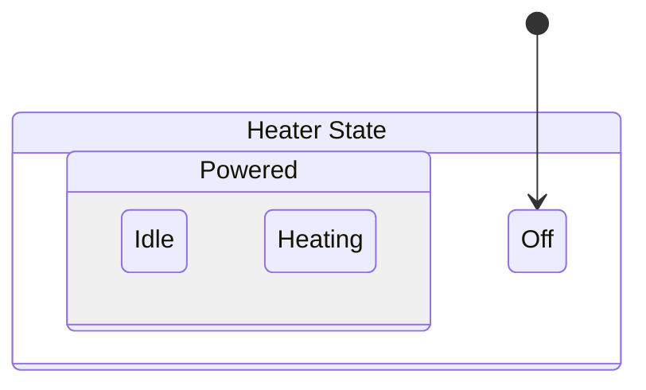

This article explains why you might want to use LogicBlocks to manage state in your game or application.

## ✅ Goals

LogicBlocks was designed in accordance with Chickensoft's development [philosophy]:

- 🍃 Flexible
  - Simple to refactor as requirements change
  - States can be easily reorganized and shared between logic blocks
  - Visually compare refactors at a glance by checking generated diagrams
- 🚀 Performant
  - Zero heap allocations if number of inputs do not exceed the cache size
  - Works in [reflection-free mode]
  - Works when compiled ahead-of-time (AOT) for platforms like iOS
- 💯 Correct
  - Programming by difference: define only the differences between states
  - Less code == easier to verify
  - Synchronous, ordered input processing for single threaded game logic
  - Diagrams are generated from the code, not the other way around
  - Run-to-completion (RTC): inputs processed immediately and synchronously
- 👀 Observable
  - Observers can listen to outputs without knowing about states
  - Observers are invoked synchronously in the order they were registered
- 🤓 Readable
  - Use existing OOP concepts: state pattern, inheritance, interfaces
  - Declarative: define all possible states, inputs, and outputs
- 🖼️ Visualizable
  - Diagrams are generated from code, not the other way around
  - Diagrams are never out-of-date
- 💾 Serializable
  - First-party support for polymorphic state and data serialization to JSON
  - AOT-friendly: serialization uses a source generator, not reflection
  - Serialization can be combined with System.Text.Json generated contexts
- ✅ Testable
  - Utilities included to make testing states easy
  - Logic blocks themselves can be mocked

## 💡 Correct Hierarchical State Lifecycles

LogicBlocks guarantees correctness when executing hierarchical state lifecycle callbacks: i.e., entrance and exit callbacks for [compound states] (also known as composite states) are **guaranteed to run only when the relevant part of the state hierarchy changes.**

:::note
Hierarchical states are represented by making a state that inherits from another state using traditional C# inheritance.

In terms of code, compound (or composite) states are simply states that are inherited from by other state types. When a state inherits from another state, it becomes a substate of that state. Otherwise, a state is known as an [atomic] (or simple) state.

```csharp
  public record ChildState : ParentState { /* ... */ }
```

:::



Any entrance or exit callbacks registered by the `Powered` state wouldn't be invoked when transitioning from `Idle` to `Heating`, since they are both `Powered` states.

On the other hand, changing from any of the `Powered` states to `Off` would result in the `Powered` state's exit callbacks being invoked. Likewise, entering a `Powered` state from `Off` would trigger the `Powered` state's entrance callbacks.

LogicBlocks differentiates between "attaching" a state and "entering" a state. Attaching a state is based on the actual state instance changing, while entering is based on the state type changing. Attach and detach callbacks are always invoked every time the state changes, whereas entrance and exit callbacks respect the type hierarchy.

:::danger
For best results, place housekeeping operations in attach and detach callbacks, and game or business related logic in entrance and exit callbacks. More on this [here][attach-vs-entrance].
:::

[compound states]: https://statecharts.dev/glossary/compound-state.html
[atomic]: https://statecharts.dev/glossary/atomic-state.html
[reflection-free mode]: https://github.com/dotnet/corert/blob/master/Documentation/using-corert/reflection-free-mode.md
[philosophy]: /docs/philosophy
[attach-vs-entrance]: ./basics/states#-attach-and-detach-vs-entrance-and-exit
