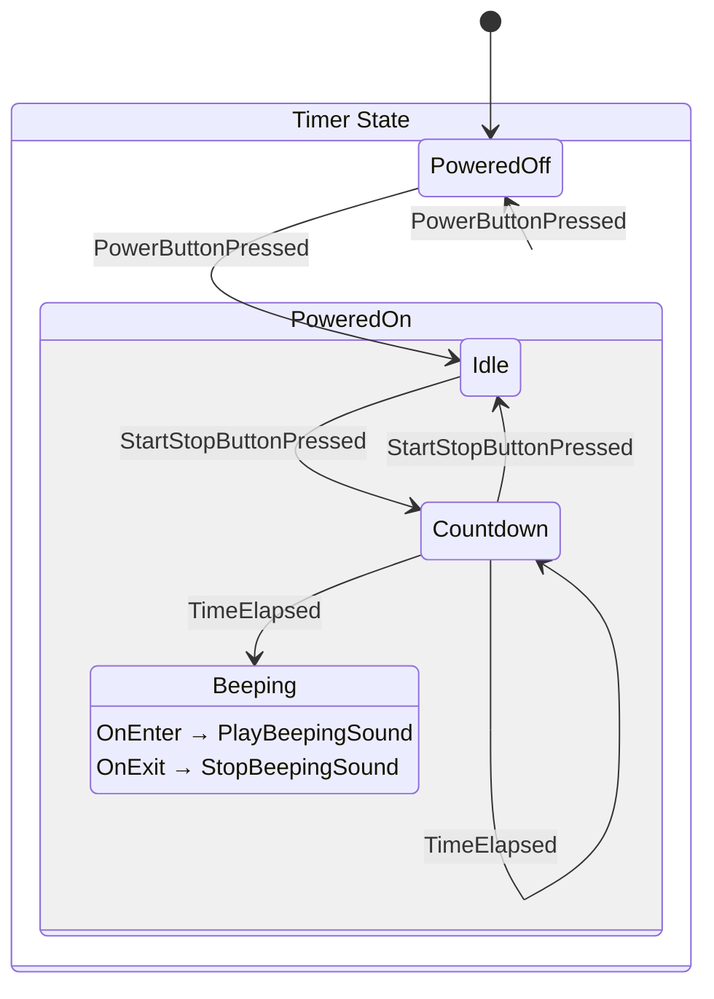

In this tutorial, we'll use LogicBlocks to create a hierarchical state machine that represents a simple kitchen timer. When we're finished, we'll have code for a state machine that produces the following diagram.

:::tip
The final code for this project is available in the `Chickensoft.LogicBlocks.Tutorial` package at the [LogicBlocks] repository.
:::

As you can see, even a simple kitchen timer contains a lot of details.

Because LogicBlocks produces diagrams from our code, we can keep tweaking our code and checking the diagram until it matches our idea of how the state machine should be designed.

[LogicBlocks]: https://github.com/chickensoft-games/LogicBlocks/
