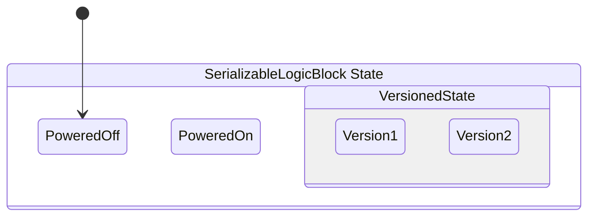

LogicBlocks can be serialized by using the Chickensoft [Introspection] and [Serialization] packages together.

Like LogicBlocks, the [Serialization] package builds off the [Introspection] package to provide a simple way of serializing and deserializing polymorphic objects, as well as support for versioning.

:::note
The serialization system is able to be used alongside System.Text.Json, since it uses the metadata generated by the Introspection generator to describe the types and information needed System.Text.Json to serialize an object — it's essentially an alternative (but compatible) generator for System.Text.Json that can be mixed and matched with other System.Text.Json generated contexts.

Using generated metadata allows the serialization system to work for ahead-of-time (AOT) platforms like iOS.
:::

### 💽 Defining a Serializable Logic Block

To make a logic block serializable, it needs to be an introspective _and_ identifiable type, as well as have a parameterless constructor.

We've been using the `[Meta]` attribute throughout the documentation to make our logic blocks introspective. LogicBlocks uses the generated metadata to automatically preallocate states when our logic block is constructed (if it's an introspective type).

Now, we simply need to add the `[Id]` attribute to the logic block itself, as well as make each state introspective. Additionally, non-abstract states need to be given an `[Id]`, too.

:::caution
Serializable type `[Id]`'s need to be globally unique across all serializable types used in your project.
:::

```csharp
using Chickensoft.Introspection;

public interface ISerializableLogicBlock : ILogicBlock<SerializableLogicBlock.State>;

[Meta, LogicBlock(typeof(State), Diagram = true)]
public partial class SerializableLogicBlock :
LogicBlock<SerializableLogicBlock.State>, ISerializableLogicBlock {
  public override Transition GetInitialState() => To<State.PoweredOff>();

  [Meta]
  public abstract partial record State : StateLogic<State> {
    [Meta, Id("serializable_logic_state_off")]
    public partial record PoweredOff : State;

    [Meta, Id("serializable_logic_state_on")]
    public partial record PoweredOn : State;
  }
}
```

The `[Id]` attribute is used as the [type discriminator] when reading and writing json data. By giving it an explicit string, you ensure your serialization system remains stable, even if the class name or location changes.

### 🤐 Serializing a Logic Block

Once you have a serializable logic block, it's easy to turn it into json (and get it back again).

```csharp
    var options = new JsonSerializerOptions {
      WriteIndented = true,
      // Use the type resolver and converter from the
      // Chickensoft.Serialization package. You can combine these with other
      // type resolvers and converters.
      TypeInfoResolver = new SerializableTypeResolver(),
      Converters = { new SerializableTypeConverter() }
    };

    var logic = new SerializableLogicBlock();

    var json = JsonSerializer.Serialize(logic, options);

    /* Produces
      """
      {
        "$type": "serializable_logic",
        "$v": 1,
        "state": {
          "$type": "serializable_logic_state_off",
          "$v": 1
        },
        "blackboard": {
          "$type": "blackboard",
          "$v": 1,
          "values": {}
        }
      }
      """
    */
```

Likewise, you can deserialize a logic block from json.

```csharp
// using the same serialization options shown above

var logic = JsonSerializer.Deserialize<SerializableLogicBlock>(
  json, options
);
```

### 🧽 Absorbing a Logic Block

When deserializing a logic block, it can be helpful to copy the state and blackboard values from a deserialized logic block into an already existing logic block. Copying the state of a deserialized logic block into an existing logic block allows you to preserve any bindings already established.

```csharp
var logic = JsonSerializer.Deserialize<SerializableLogicBlock>(
  json, options
);

// Copy the state and blackboard of the deserialized logic block into an
// existing logic block.
existingLogicBlock.RestoreFrom(logic);

// Now our existing logic block is in the same state and has the same blackboard
// values as the logic block we deserialized, allowing us to continue where we
// left off.
```

### 🧑‍🏫 Saving Blackboard Values

Since most blackboard values represent runtime dependencies, blackboard values are not persisted by default when serializing a logic block.

You can register blackboard values that _will_ get serialized. This is done by using the blackboard's `Save()` method. Since every logic block implements the blackboard interface, we can do so easily after creating the logic block.

```csharp
[Meta, Id("my_related_data")]
public partial record MyRelatedData {
  public required string Name { get; init; }
  public string? Description { get; init; }
}

var logic = new SerializableLogicBlock();

// Not persisted — just adding a runtime dependency.
logic.Set(new MyRelatedService());

// Will be persisted if we serialize the logic block.
// Types saved this way must be introspective, identifiable types, too.
logic.Save(() => new MyRelatedData());
```

By requiring you to pass in a factory closure, the serialization system ensures the value is only created when needed — allowing `RestoreFrom()` to provide a value instead if you call it before using an existing logic block.

### ⏳ Versioning

Logic blocks supports [versioning] states.

```csharp
[Meta, Id("serializable_logic_versioned_state")]
public abstract partial record VersionedState;

[Meta, Version(1)]
public partial record Version1 : VersionedState;

[Meta, Version(2)]
public partial record Version2 : VersionedState;
```

This results in the following state hierarchy:



:::note
The `[Id]` is moved to an abstract base type and the `[Version]` attribute is applied to the derived types.

You can shuffle around type hierarchies to match your versioning logic as long as the id's and shape of the types remain stable across versions.
:::

### 😶‍🌫️ Testing Abstract Serializable States

When you give a logic block an `[Id]` to make it serializable, it suddenly requires that every state be an introspective type so it can be pre-allocated and serialized correctly.

When testing abstract logic block states, it is common to create a concrete test implementation of the state for testing purposes:

```csharp
public class MyTest {
  public class SomeState : SerializableLogicBlock.SomeAbstractState;

  [Fact]
  public void Initializes() => new TestState().ShouldNotBeNull();
}
```

Serializable logic blocks, however, require that `TestState` be introspective and identifiable (since it is a concrete type). Otherwise, you'd get an error when creating the logic block.

```csharp
[Meta, Id("serializable_logic_test_some_state")]
public partial class SomeState : SerializableLogicBlock.SomeAbstractState;
```

You can simply add the `[TestState]` attribute to the state to prevent logic blocks from trying to preallocate it and verify that it is serializable.

```csharp
[TestState, Meta, Id("serializable_logic_test_some_state")]
public partial class SomeState : SerializableLogicBlock.SomeAbstractState;
```

---

Be sure to read the [Serialization] package's readme for additional tips on making serializable types.

[Introspection]: https://github.com/chickensoft-games/Introspection
[Serialization]: https://github.com/chickensoft-games/Serialization
[type discriminator]: https://learn.microsoft.com/en-us/dotnet/standard/serialization/system-text-json/polymorphism?
[versioning]: https://github.com/chickensoft-games/Serialization?tab=readme-ov-file#-versioning
